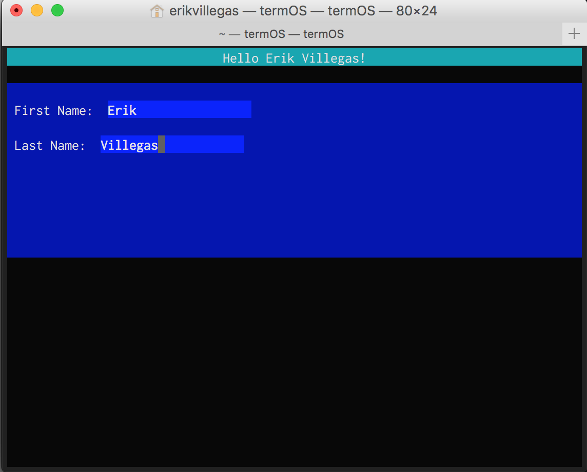

# termOS

termOS is a Swift wrapper over [Termbox](https://github.com/nsf/termbox). It also provides a UIKit-like interface that makes it super simple to create colorful and interactive command-line programs.

Example:

```swift
override func viewDidLoad() {
    super.viewDidLoad()
        
    let headerLabel = Label(text: "Hello!")
    headerLabel.frame = Frame(x: 0, y: 0, width: view.frame.width, height: 1)
    headerLabel.textColor = .White
    headerLabel.backgroundColor = .Cyan
    headerLabel.textAlignment = .Center
      
    view.addSubview(headerLabel)
}
```


